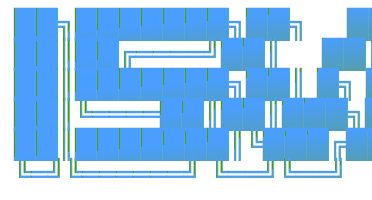

<!--
  framework-llm — public releases repository
  Source code is private. Only pre-compiled binaries are distributed here.
-->

<div align="center">



**Energy-aware code analysis and LLM-assisted optimization framework**


</div>

---

> **Binaries only.** This repository distributes pre-compiled, obfuscated binaries.
> The source code lives in a separate private repository and is not published here.

---

## Contents

- [What is `isw`?](#what-is-isw)
- [Install](#install)
- [Uninstall](#uninstall)
- [Quick start](#quick-start)
- [How it works](#how-it-works)
- [Commands](#commands)
- [Configuration](#configuration)
- [EPU — Energy Points per Use](#epu--energy-points-per-use)
- [Output formats](#output-formats)
- [Command aliases](#command-aliases)
- [Platforms](#platforms)
- [License](#license)

---

## What is `isw`?

`isw` is a command-line tool that helps developers **understand and reduce the
computational cost of their codebases**. It works in two layers:

**Offline analysis** — no network, no API key required:
- Scans source files across JavaScript, TypeScript, Python, Java, C, C++, and C#
- Scores every file with the **EPU metric** (Energy Points per Use, 1.0–10.0)
- Ranks hotspots by their estimated energy impact
- Checks that the ranking is robust to parameter changes (sensitivity analysis)
- Measures real runtime, CPU, and RAM by running your project (Intel RAPL energy on Linux)

**LLM-assisted optimization** — opt-in, requires your own API key:
- Runs a structural codemod pass and ranks every fixable hotspot
- Proposes concrete, developer-supervised changes
- Never writes a file without `--apply`; dry-run is always the default

---

## Install

### Windows

**winget (Windows Package Manager)** — once published, the cleanest install.
`winget` verifies the download hash and adds `isw` to your `PATH` automatically:
```powershell
winget install isw
```
> Or by full id: `winget install TP202610017.ISW`.

**Easiest — double-click.** Download **`install.bat`** from the
[latest release](https://github.com/TP202610017/framework-llm-releases/releases/latest)
and double-click it. No command line, no PowerShell knowledge needed.

**PowerShell:**
```powershell
irm https://github.com/TP202610017/framework-llm-releases/releases/latest/download/install.ps1 | iex
```

**Command Prompt (CMD):** `irm` is a PowerShell command, so from CMD run it
through `powershell`:
```bat
powershell -NoProfile -ExecutionPolicy Bypass -Command "irm https://github.com/TP202610017/framework-llm-releases/releases/latest/download/install.ps1 | iex"
```

All three install to `%LOCALAPPDATA%\Programs\isw\isw.exe` and add it to your
**user** `PATH` — **no administrator rights needed**. Open a new terminal
afterwards and run `isw`.

### macOS / Linux

```bash
curl -fsSL https://github.com/TP202610017/framework-llm-releases/releases/latest/download/install.sh | bash
```

The binary is placed at `~/.local/bin/isw`. If that directory is not yet on
your `PATH`, the installer prints the one-line `export` to add to your shell rc.

### Manual install

Download the archive for your platform from the
[latest release](https://github.com/TP202610017/framework-llm-releases/releases/latest),
extract `isw` (`isw.exe` on Windows), make it executable (`chmod +x isw` on Unix),
and move it anywhere on your `PATH`. Verify your download against the included
`checksums.txt` (SHA-256).

---

## Uninstall

### winget

If you installed with winget:

```powershell
winget uninstall isw
# or by full id:
winget uninstall TP202610017.isw
```

### Windows (install.ps1 / install.bat / manual)

The installer places the binary in `%LOCALAPPDATA%\Programs\isw` and adds that
folder to your **User** `PATH`. To remove both:

```powershell
# 1. Delete the binary
Remove-Item -Recurse -Force "$env:LOCALAPPDATA\Programs\isw"

# 2. Remove the folder from your User PATH
$dir   = "$env:LOCALAPPDATA\Programs\isw"
$path  = [Environment]::GetEnvironmentVariable('Path', 'User')
$clean = ($path -split ';' | Where-Object { $_ -and $_ -ne $dir }) -join ';'
[Environment]::SetEnvironmentVariable('Path', $clean, 'User')
```

Open a new terminal for the `PATH` change to take effect.

### macOS / Linux

```bash
rm -f ~/.local/bin/isw
```

If you added `export PATH="$HOME/.local/bin:$PATH"` to your shell rc just for
`isw`, you can delete that line too (it is harmless to leave).

### Remove leftover project state (optional)

`isw` never writes to a global location — it only touches a project when you use
`--apply` / `--backup`, and those files sit next to your code. To clear them, run
this **inside a project** where you used `isw`:

```bash
rm -rf .isw-framework        # backups / state
rm -f  isw.yaml              # local config, if you created one
```

```powershell
Remove-Item -Recurse -Force .\.isw-framework -ErrorAction SilentlyContinue
Remove-Item -Force .\isw.yaml -ErrorAction SilentlyContinue
```

---

## Quick start

```bash
# 1. Get a feel for the project
isw analyze -p .

# 2. Find the files with the biggest energy footprint
isw hotspots -p .

# 3. See how robust that ranking is
isw sensitivity -p .

# 4. Preview structural optimizations (dry-run, nothing is written)
isw optimize -p .

# Or just run isw with no arguments for an interactive menu
isw
```

Every command runs **fully offline** except the LLM-assisted path
(`optimize --agent` / `refactor --agent`), which needs an API key you
configure yourself.

---

## How it works

```
   your code                                          decision
   ─────────                                          ────────
   analyze   →  metrics  →  hotspots  →  sensitivity  →  optimize
   (overview)   (resources)  (EPU rank)   (is the rank   (preview / apply
                                           trustworthy?)   structural fixes)
                                  │
                              measure  ── run the project for REAL CPU/RAM/energy
```

Start with `analyze`/`hotspots` to see where the cost is, confirm the ranking is
stable with `sensitivity`, optionally ground it in a real run with `measure`,
then use `optimize` to act on it.

---

## Commands

All commands accept `-o / --output` (`table` default, `json`, `yaml`, `csv`) and
`-p / --path` to point at any directory. Outputs below are **real** samples from
the tool.

### `analyze`

**Project overview** — file count, total size, and a per-extension breakdown.
The fastest way to get oriented in an unfamiliar repository.

```bash
isw analyze -p .
```

```
EXTENSION  FILES  BYTES
---------  -----  -----
.go        121    749624
```

### `metrics`

**Resource & language breakdown** — languages detected and each one's share of
the codebase.

```bash
isw metrics -p .
```

```
LANGUAGE  EXTENSION  FILES  BYTES   SHARE %
--------  ---------  -----  -----   -------
Go        .go        33     195403  100.00
```

### `hotspots`

**Energy ranking** — every non-test source file scored and ordered by impact.
`SCORE` is the 0–10 energy score; `CEE-kWh` is the estimated energy per run.
These are the best candidates for optimization.

```bash
isw hotspots -p .
```

```
SCORE   CEE-kWh          LINES  PATH
-----   -------          -----  ----
5.7/10  0.000000067 kWh  975    codemod/node_ast.go
5.1/10  0.000000060 kWh  871    behavioural_validator.go
3.9/10  0.000000032 kWh  468    codemod/python_ast.go
3.9/10  0.000000025 kWh  368    codemod/c_scan.go
3.8/10  0.000000038 kWh  552    lang_validator.go
3.6/10  0.000000019 kWh  282    treesitter/cpp_walk.go
```

> Test files (`*_test.go`, `test_*.py`, `*.test.ts`, `*Test.java`, …) are
> automatically excluded from every ranking.

### `scores`

**Full EPU breakdown** — one row per file with the raw components behind the
score. Ideal for exporting to a spreadsheet or your own analysis.

```bash
isw scores -p . -o csv
```

```
epu,ctx_score,share_score,share_epu,energy_score,cee_kwh_per_run,share_pct,lines,bytes,path
6.2,0.4518,0.7778,8.00,8,0.000000086376,19.78,1156,37120,engine.go
5.0,0.4398,0.4556,5.10,5,0.000000029963,6.86,401,16811,context.go
4.4,0.3414,0.4444,5.00,5,0.000000028543,6.54,382,11868,optimization_ranker.go
```

### `sensitivity`

**Robustness analysis** — re-scores the project under 8 parameter scenarios
(weight sweeps and saturation jitter) and reports how much the ranking moves.
High `KENDALL_TAU` / `SPEARMAN_RHO` (close to 1.0) means the ranking is stable
and not an artifact of one specific parameter choice.

```bash
isw sensitivity -p .
```

```
SCENARIO         KENDALL_TAU  SPEARMAN_RHO  TOPK_RETAIN  MAX_EPU_DELTA
--------         -----------  ------------  -----------  -------------
w=0.4            0.963        0.997         0.90         0.61
w=0.5            0.993        1.000         0.90         0.31
w=0.7            0.991        1.000         1.00         0.30
w=0.8            0.977        0.998         1.00         0.60
weights x0.8     0.993        1.000         0.90         0.59
weights x1.2     0.992        1.000         1.00         0.58
saturation x0.8  0.980        0.998         0.90         0.41
saturation x1.2  0.991        0.999         1.00         0.28

files=70 · min Kendall-tau=0.963 · min top-10 retention=0.90
```

### `measure`

**Real measurement** — runs a command in the project and samples CPU and RAM
during execution, returning measured energy (CEM-kWh). On Linux with Intel RAPL
the energy is read from hardware; on Windows/macOS it falls back to a parametric
estimate, clearly labelled.

```bash
isw measure -c "go test ./..." -p .
isw measure -c "python main.py" --sample-interval 50ms
```

| Flag                | Default | Description                                  |
|---------------------|---------|----------------------------------------------|
| `-c, --command`     | —       | Command to execute under measurement         |
| `-p, --path`        | `.`     | Working directory for the command            |
| `--sample-interval` | `100ms` | CPU/RAM sampling interval                     |

| Field           | Linux (RAPL)   | Windows / macOS        |
|-----------------|----------------|------------------------|
| Wall time       | measured       | measured               |
| CPU time        | measured       | measured               |
| Peak RAM        | measured       | measured               |
| Energy          | measured (HW)  | estimated (parametric) |

### `optimize`

**LLM-assisted structural optimization** (flagship). Runs the codemod registry
over the project, ranks every fixable hotspot, and reports what it would change.
**Dry-run by default — it never touches the filesystem unless you pass `--apply`.**
With `--apply`, only low-risk auto-fixes are written, and every write is gated by
the validator chain (generic → Tree-sitter → per-language → optional LSP).

```bash
# Preview only — rank hotspots and codemod findings, write nothing
isw optimize -p .

# Apply the low-risk structural fixes (validator-gated)
isw optimize -p . --apply
```

The report distinguishes hotspots detected, candidates ranked
(score / confidence / risk), patches generated, patches actually applied, and
report-only opportunities the tool intentionally never auto-applies.

### `refactor`

**Refactoring plan** — produces a plan for the top hotspots (offline, or enriched
with `--agent` when an API key is set). Dry-run is the default; `--apply` is
required to write and prompts for confirmation unless `--yes` is given.

```bash
isw refactor -p .                       # offline plan, dry-run
isw refactor -p . --agent --dry-run     # agent-enriched plan
isw refactor -p . --apply --backup      # apply with a pre-image snapshot
```

| Flag                 | Default | Description                                            |
|----------------------|---------|--------------------------------------------------------|
| `--agent`            | off     | Enrich the plan with the LLM agent                     |
| `--dry-run`          | on      | Preview without writing                                |
| `--apply`            | off     | Write the changes (disables dry-run)                   |
| `--backup`           | off     | Snapshot originals to `.isw-framework/backups/`        |
| `--max-files`        | 3       | Cap how many files the plan may touch                  |
| `--risk-level`       | low     | Hint for the agent: `low` / `medium` / `high`          |
| `-y, --yes`          | off     | Skip the confirmation prompt (requires `--apply`)      |
| `--update-gitignore` | off     | Add `.isw-framework/` to `.gitignore` after apply      |

**Safety:** without `--apply` no file is ever modified — dry-run is enforced at
the write layer, not just the flag parser. `--apply` is rejected in non-table
output modes to keep automation safe.

### `recommend`

**Offline recommendations** derived from metrics + hotspots. No LLM is consulted;
results are deterministic.

```bash
isw recommend -p . -o json
```

### `report`

**Combined report** — bundles `analyze`, `metrics`, `hotspots`, and `recommend`
into a single payload. Handy for CI pipelines.

```bash
isw report -p . -o json
```

### `benchmark`

**Project probe** — wall time, CPU, peak RAM, and I/O for the project. Currently a
simulated, deterministic probe (clearly labelled as such in the output).

```bash
isw benchmark -p .
```

```
METRIC          VALUE
------          -----
duration        139ms
cpu_user_s      0.097
cpu_system_s    0.028
peak_rss_bytes  67157714
notes           simulated benchmark; replace with real probe
```

### `calibrate`

**Criterion validity** — reads a paired CSV of EPU scores and measured energy,
fits a linear model, and reports Pearson-r, R², and a verdict on how well EPU
predicts real energy.

```bash
isw calibrate --data measurements.csv --epu-col epu --energy-col joules
```

### `baseline` / `rollback`

`baseline` manages the saved energy baseline used to compare a project before and
after a refactor; `rollback` (aliases `undo`, `rb`) reverts a previously applied
change set.

```bash
isw baseline -p .
isw rollback -p .
```

### `config show`

Prints the fully resolved configuration. The API key is redacted — only
`llm_api_key_set: true/false` is shown.

```bash
isw config show
```

### `version`

Prints name, version, commit hash, and build date.

```bash
isw version
```

---

## Configuration

Settings are resolved in this order (highest priority first):

```
CLI flags  >  environment variables  >  isw.yaml  >  built-in defaults
```

### Environment variables

| Variable               | Description                                           |
|------------------------|-------------------------------------------------------|
| `ANTHROPIC_API_KEY`    | API key for the Claude provider (default key env)     |
| `ISW_LLM_PROVIDER`     | LLM provider: `claude`, `openai`, `gemini`, or `mock` |
| `ISW_LLM_MODEL`        | Model name override                                   |
| `ISW_LLM_API_KEY_ENV`  | Name of the env var that holds the API key            |

### Config file (`isw.yaml`)

Place it in your project root, or pass `--config path/to/isw.yaml`:

```yaml
llm:
  provider: claude          # mock | claude | openai | gemini
  model: claude-haiku-4-5

refactor:
  dry_run: true
  backup: true
  max_files: 5
  risk_level: low

ui:
  interactive: true
  color: true

scoring:
  saturation_scale: 1.0     # scales all knee/cap values uniformly
```

Offline commands ignore the LLM config entirely. With `provider: mock` (the
default) everything works with no key and no network.

---

## EPU — Energy Points per Use

EPU is the core metric. Each source file gets a score from **1.0** (minimal
footprint) to **10.0** (high energy impact), built from two components:

- **Context score (`ctx`)** — density of expensive patterns (loops, I/O, database
  calls, regex, crypto) weighted by file size and nesting depth.
- **Sharing penalty (`share`)** — how widely the file is reused, which multiplies
  its cost across the system.

```
EPU = round( 1 + 9 * (0.6 * ctx_score + 0.4 * share_score) , 2)
```

**Worked example** (the `engine.go` row from `scores` above):

```
ctx = 0.4518,  share = 0.7778
EPU = 1 + 9 * (0.6 * 0.4518 + 0.4 * 0.7778)
    = 1 + 9 * 0.5822
    = 6.24
```

Both components pass through a saturation function that compresses extreme values,
which is what makes the ranking robust to parameter choices — exactly what the
`sensitivity` command verifies.

---

## Output formats

Every command supports `-o / --output`:

| Format  | Use case                              |
|---------|---------------------------------------|
| `table` | Human-readable, terminal-friendly     |
| `json`  | Scripting, CI pipelines               |
| `yaml`  | Configuration-style tooling           |
| `csv`   | Spreadsheets, R / Python analysis     |

```bash
isw hotspots -p . -o json | jq '.[] | select(.epu > 5)'
isw scores   -p . -o csv  > scores.csv
isw report   -p . -o json > report.json
```

---

## Command aliases

| Command       | Alias(es)     |
|---------------|---------------|
| `analyze`     | `a`           |
| `metrics`     | `m`           |
| `hotspots`    | `h`           |
| `scores`      | `sc`          |
| `sensitivity` | `sens`        |
| `measure`     | `me`          |
| `optimize`    | `opt`, `energy` |
| `refactor`    | `fx`          |
| `recommend`   | `r`           |
| `report`      | `rep`         |
| `benchmark`   | `b`           |
| `baseline`    | `bl`          |
| `rollback`    | `rb`, `undo`  |
| `interactive` | `i`           |
| `config`      | `c`           |
| `version`     | `v`           |

`calibrate` has no short alias.

---

## Platforms

Single static binary, no runtime dependencies, no installer required beyond the
one-liner above.

| Platform | Architecture |
|----------|--------------|
| Linux    | amd64, arm64 |
| macOS    | amd64, arm64 |
| Windows  | amd64        |

Each release ships a `checksums.txt` (SHA-256) to verify your download.

---

## License

Binaries are distributed for academic and research use.
© 2026 TP202610017. All rights reserved to the source code.
Redistribution of the binaries is permitted; reverse engineering is not.
